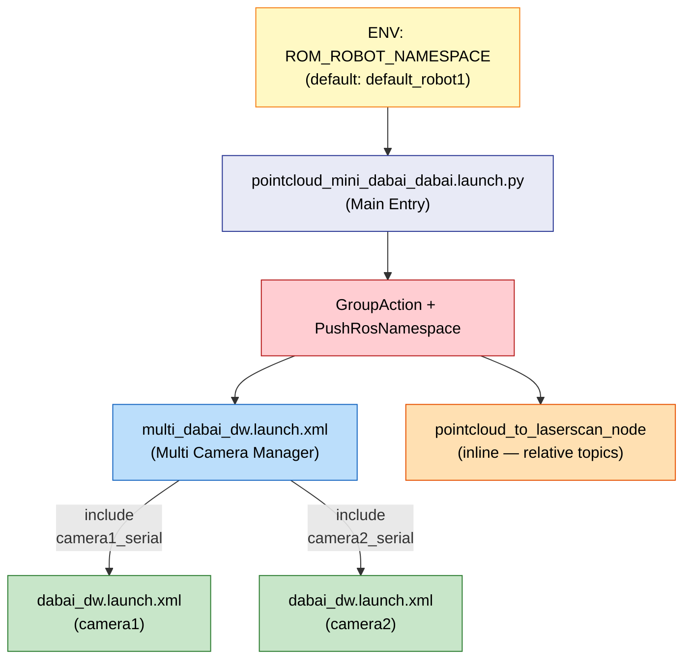
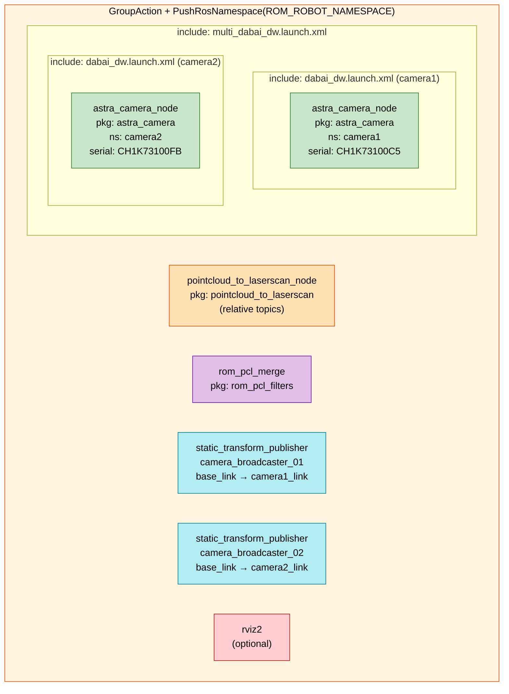
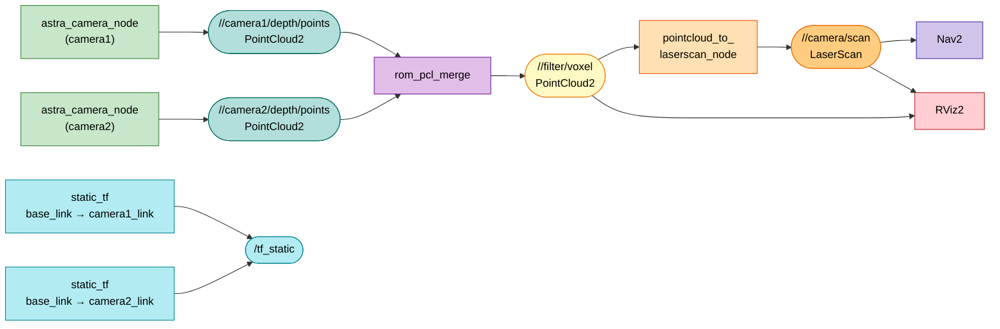
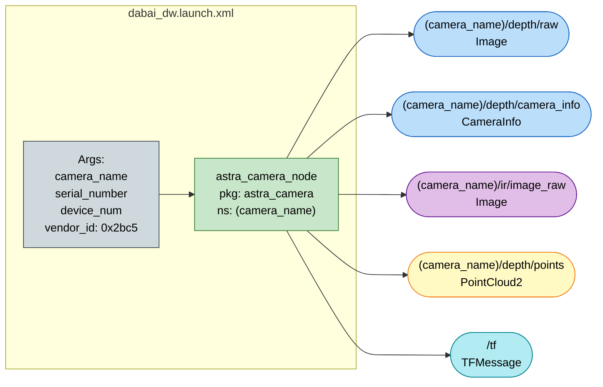
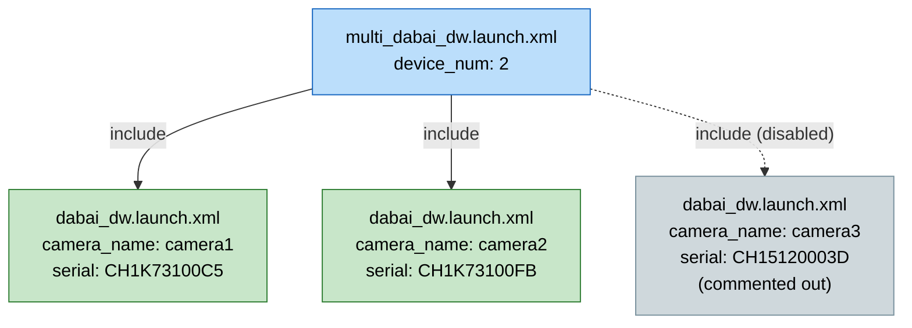
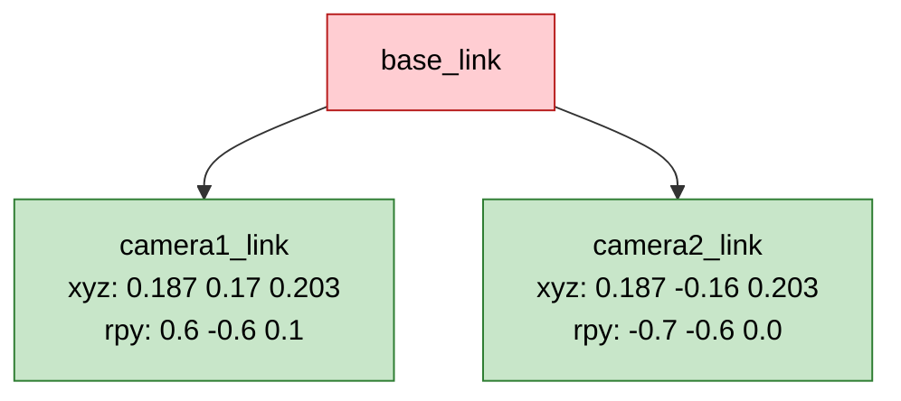

# rom_dabai_3d_camera

> ROM Robotics — Dabai DW 3D Depth Camera Launch Package (ROS 2 Humble)

---

## Environment Variables

| Variable | Default | Description |
|---|---|---|
| `ROM_ROBOT_NAMESPACE` | `default_robot1` | ROS 2 namespace — topics/services အားလုံး `/<namespace>/...` အောက်တွင် ရှိမည် |
| `ROM_ROBOT_MODEL` | `edu_robot` | Robot model name (`rom_pcl_merge` param) |

```bash
# Set before launch
export ROM_ROBOT_NAMESPACE=edu_robot01
export ROM_ROBOT_MODEL=edu_robot
ros2 launch rom_dabai_3d_camera pointcloud_mini_dabai_dabai.launch.py use_rviz:=false
```

---

## Launch File Hierarchy

```
launch/
├── pointcloud_mini_dabai_dabai.launch.py   # Main entry (namespace-aware)
├── multi_dabai_dw.launch.xml               # Multi camera manager (included)
└── dabai_dw.launch.xml                     # Single camera node (included)
```



---

## pointcloud_mini_dabai_dabai.launch.py — Nodes & Connections



---

## Topic Data Flow (with namespace)

> `ROM_ROBOT_NAMESPACE=edu_robot01` ဆိုရင် topics အားလုံး `/edu_robot01/...` prefix ပါလာမည်



---

## dabai_dw.launch.xml — Single Camera Node



---

## multi_dabai_dw.launch.xml — Multi Camera Include



---

## Static TF Transforms



---

*ROM Robotics © 2026*