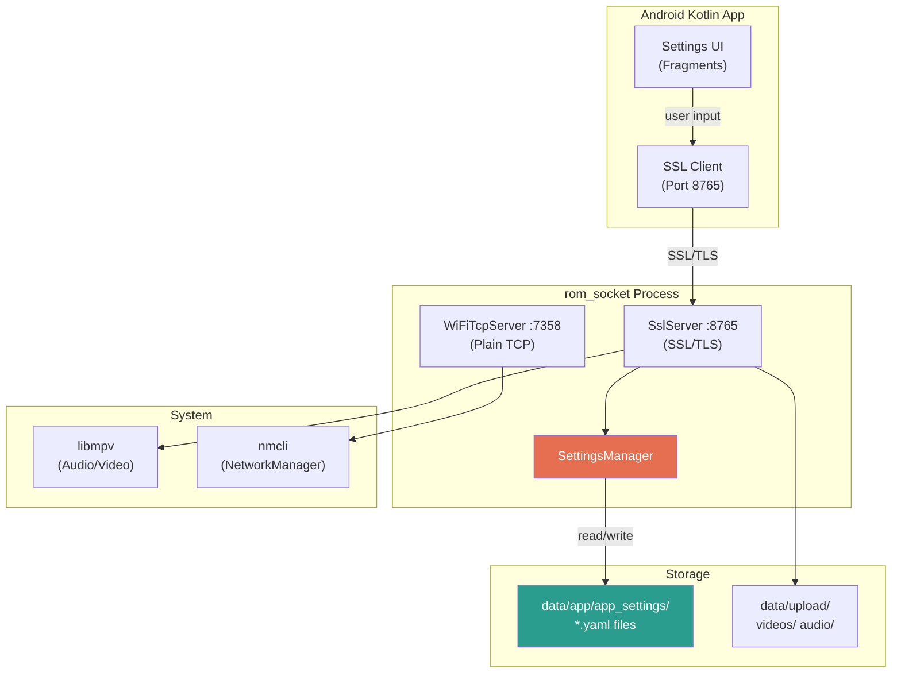
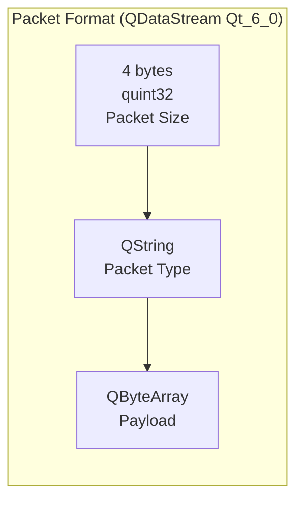
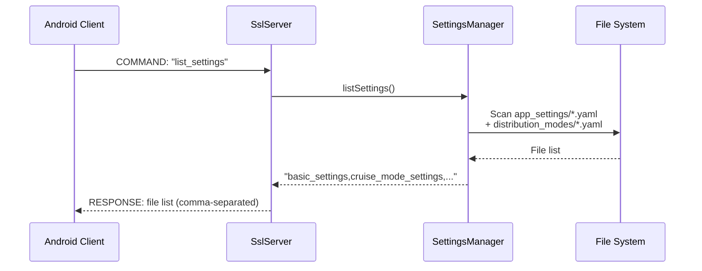
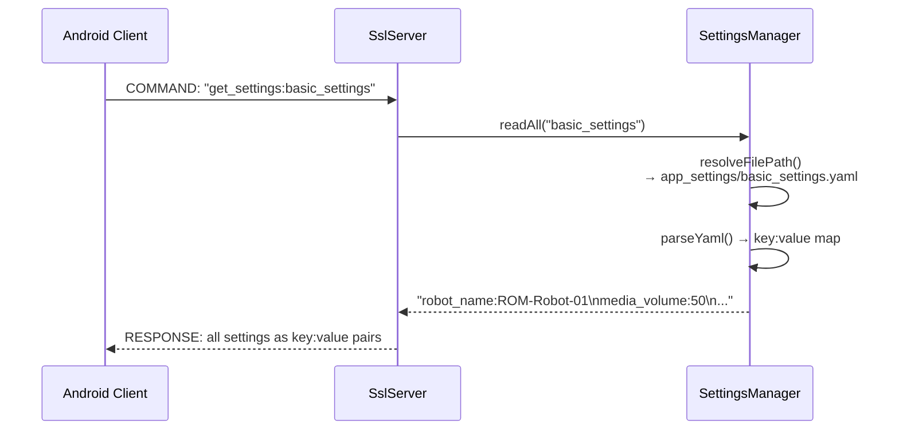
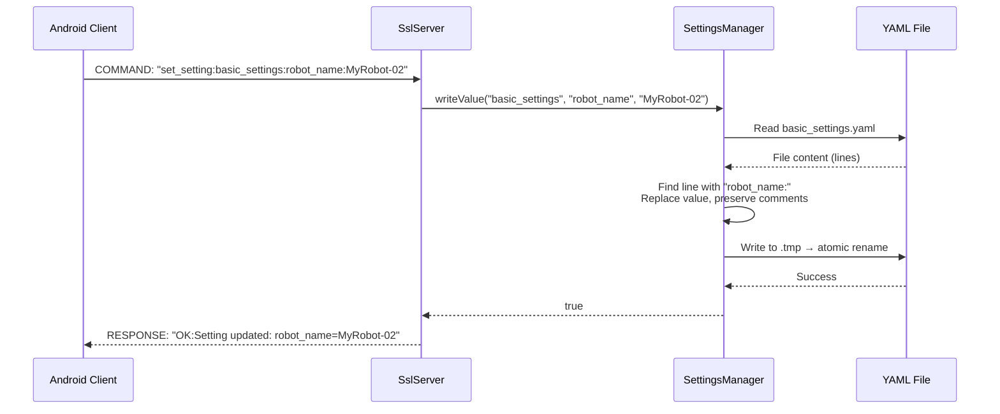
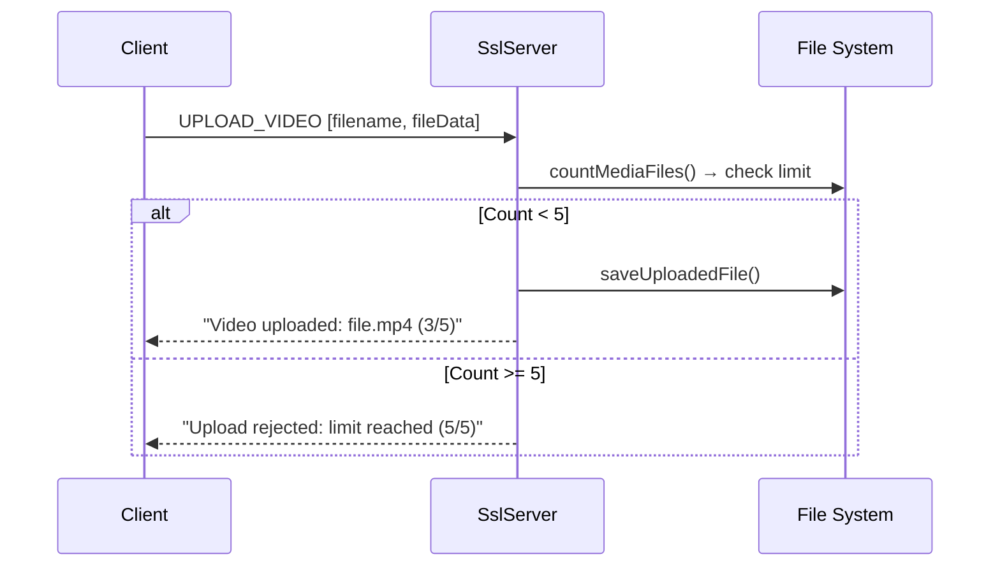
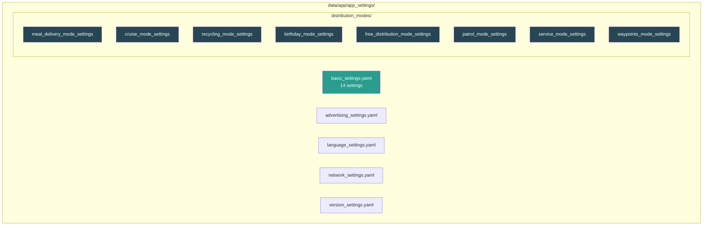
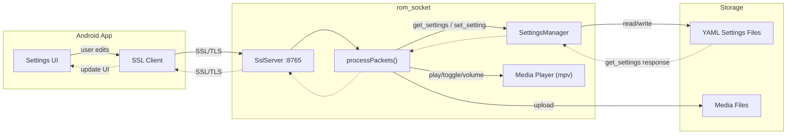

# ROM Socket - API Reference & Architecture

## System Overview



---

## Packet Protocol



**Packet Types:**

| Type | Direction | Payload |
|------|-----------|---------|
| `COMMAND` | Client → Server | Command string (UTF-8) |
| `UPLOAD_VIDEO` | Client → Server | filename (QString) + fileData (QByteArray) |
| `UPLOAD_AUDIO` | Client → Server | filename (QString) + fileData (QByteArray) |
| `RESPONSE` | Server → Client | Response string (UTF-8) |

---

## Settings API Commands

### `list_settings`
List all available settings files.

```
→ COMMAND: "list_settings"
← RESPONSE: "basic_settings,advertising_settings,language_settings,...,meal_delivery_mode_settings,..."
```



---

### `get_settings:<name>`
Read all key-value pairs from a settings file.

```
→ COMMAND: "get_settings:basic_settings"
← RESPONSE: "robot_name:ROM-Robot-01\nmedia_volume:50\nscreen_brightness:70\n..."
```



---

### `get_setting_value:<name>:<key>`
Read a single setting value.

```
→ COMMAND: "get_setting_value:basic_settings:robot_name"
← RESPONSE: "ROM-Robot-01"
```

---

### `set_setting:<name>:<key>:<value>`
Write/update a single setting.

```
→ COMMAND: "set_setting:basic_settings:robot_name:MyRobot-02"
← RESPONSE: "OK:Setting updated: robot_name=MyRobot-02"
```



---

### `set_settings:<name>:<key1>:<value1>\n<key2>:<value2>`
Write multiple settings at once.

```
→ COMMAND: "set_settings:basic_settings:robot_name:NewBot\nmedia_volume:80"
← RESPONSE: "OK:Settings updated for basic_settings"
```

---

## Media API Commands

### Video Commands

| Command | Response | Description |
|---------|----------|-------------|
| `show_video` | `"video1.mp4,video2.mp4"` | List video files |
| `play_video:<filename>` | `"Playing video: filename"` | Play via mpv |
| `toggle_video` | `"Video playback toggled"` | Pause / Resume |
| `set_video_volume:<0-100>` | `"Video volume set to: N"` | Set volume |
| `get_video_volume` | `"Video volume: N"` | Get current volume |

### Audio Commands

| Command | Response | Description |
|---------|----------|-------------|
| `show_audio` | `"song1.mp3,song2.mp3"` | List audio files |
| `play_audio:<filename>` | `"Playing audio: filename"` | Play via mpv |
| `toggle_audio` | `"Audio playback toggled"` | Pause / Resume |
| `set_audio_volume:<0-100>` | `"Audio volume set to: N"` | Set volume |
| `get_audio_volume` | `"Audio volume: N"` | Get current volume |

### Upload Commands



| Upload Type | Max Files | Storage Path |
|-------------|-----------|-------------|
| `UPLOAD_VIDEO` | 5 | `/home/mr_robot/data/upload/videos/` |
| `UPLOAD_AUDIO` | 10 | `/home/mr_robot/data/upload/audio/` |

---

## WiFi API Commands (Port 7358, Plain TCP)

| Command | Response | Description |
|---------|----------|-------------|
| `SEARCH_WIFI` | `"WIFI_LIST:ssid:signal:security:active,..."` | Scan WiFi networks |
| `CONNECT_WIFI:<ssid>:<pwd>` | `"CONNECT_OK:<ssid>"` or `"ERROR:msg"` | Connect to WiFi |
| `DISCONNECT_WIFI` | `"DISCONNECT_OK"` or `"ERROR:msg"` | Disconnect WiFi |
| `CURRENT_WIFI` | `"CURRENT_WIFI:<ssid>:<ip>"` | Get current WiFi info |

---

## Settings Files Reference



### basic_settings.yaml

| Key | Default | Type | Range |
|-----|---------|------|-------|
| `robot_name` | `"ROM-Robot-01"` | string | - |
| `media_volume` | `50` | int | 1–100 |
| `screen_brightness` | `70` | int | 1–100 |
| `low_battery_setting` | `24` | int | 0–48 |
| `obstacle_avoidance_prompt` | `"Excuse me..."` | string | - |
| `administrator_password` | `1` | int | 0 / 1 |
| `display_content_during_delivery` | `0` | int | 0 / 1 |
| `emoticon_animation` | `"style1"` | string | style1 / style2 |
| `table_distribution` | `"three_columns"` | string | three_columns / four_columns |
| `data_synchronization` | `"myanmar"` | string | myanmar / other |
| `relocate` | `false` | bool | true / false |
| `switch_map` | `false` | bool | true / false |
| `call_module_configuration` | `false` | bool | true / false |
| `multi_machine_configuration` | `false` | bool | true / false |

### Distribution Mode Settings

| Mode | Key Settings |
|------|-------------|
| **meal_delivery** | operating_speed_ms, waiting_time_for_meal_taking, food_delivery_arrival_reminder, select_background_music |
| **cruise** | operating_speed_ms, select_background_music, circular_broadcast, broadcast_interval |
| **recycling** | operating_speed_ms, residence_time, prompt_for_placing_recyclables, prompt_after_placing_recyclables |
| **birthday** | operating_speed_ms, waiting_time_for_meal_taking, prompt_for_delivery_arrival, prompt_after_taking_meal, select_background_music, background_music_playing_time_point |
| **free_distribution** | operating_speed_ms, waiting_time_for_meal_taking, food_delivery_arrival_reminder, select_background_music |
| **patrol** | num_cycles, replanning_rate_hz, planner_id, controller_id, server_timeout, recovery params |
| **service** | delay_between_waypoints_ms, replanning_rate_hz, planner_id, controller_id, server_timeout, recovery params |
| **waypoints** | replanning_rate_hz, planner_id, controller_id, server_timeout, recovery params, time_allowance |

---

## Complete Data Flow



---

## Error Responses

All error responses start with `ERROR:` prefix:

| Error | Cause |
|-------|-------|
| `ERROR:Settings not found: <name>` | YAML file does not exist |
| `ERROR:Empty or invalid settings file: <name>` | YAML file is empty or unparseable |
| `ERROR:Key not found: <key>` | Key does not exist in the YAML file |
| `ERROR:Failed to update: <key>` | File write/permission error |
| `ERROR:Invalid format. Use ...` | Malformed command string |

---

## Security Notes

- SSL/TLS 1.2+ with self-signed certificate (CN=GhostMan, O=ROM-Robotics)
- Path traversal protection: `..`, `/`, `\` in settings names are rejected
- Atomic file writes: write to `.tmp` then rename (prevents corruption)
- Thread-safe: QMutex protects all file R/W operations
- WiFi server on Ethernet-only interface (10.0.0.100) — not exposed over WiFi
