# ROM Socket - Architecture & Flow Diagrams

## 1. Overall System Architecture

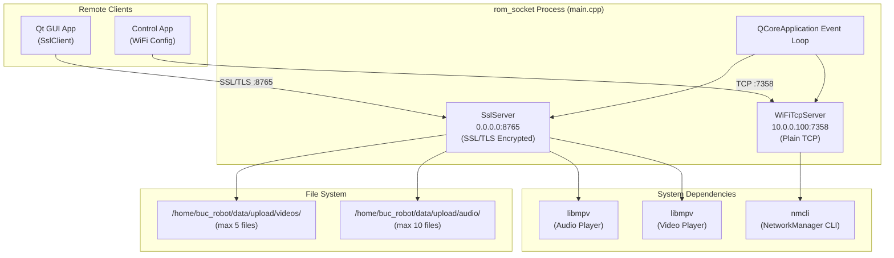

---

## 2. Application Startup Flow

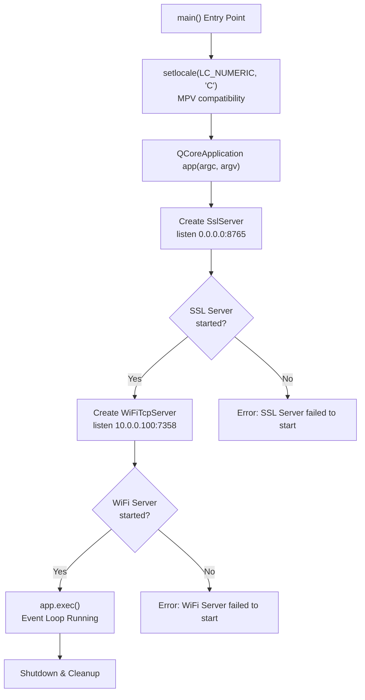

---

## 3. SslServer - Class Structure & Functions

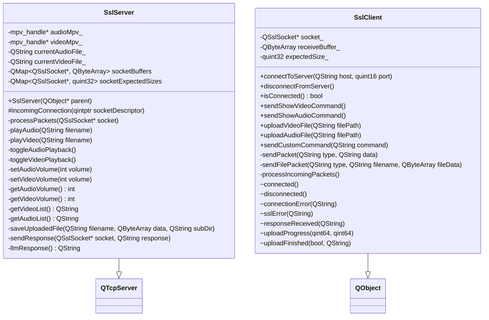

---

## 4. WiFi Server - Class Structure

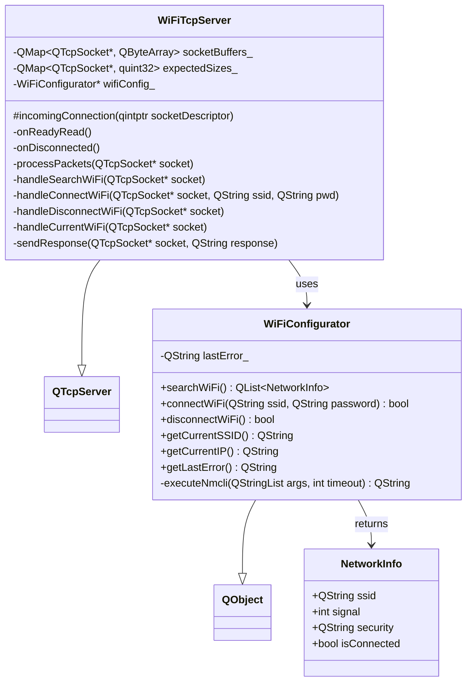

---

## 5. SSL Connection & Handshake Flow

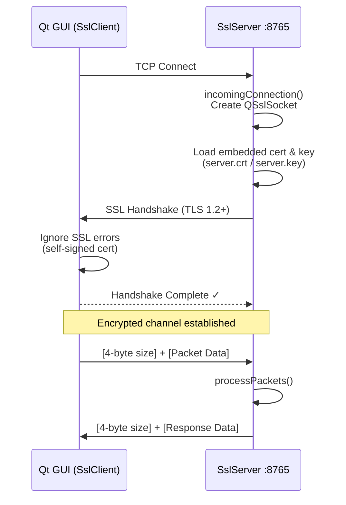

---

## 6. Packet Protocol Structure

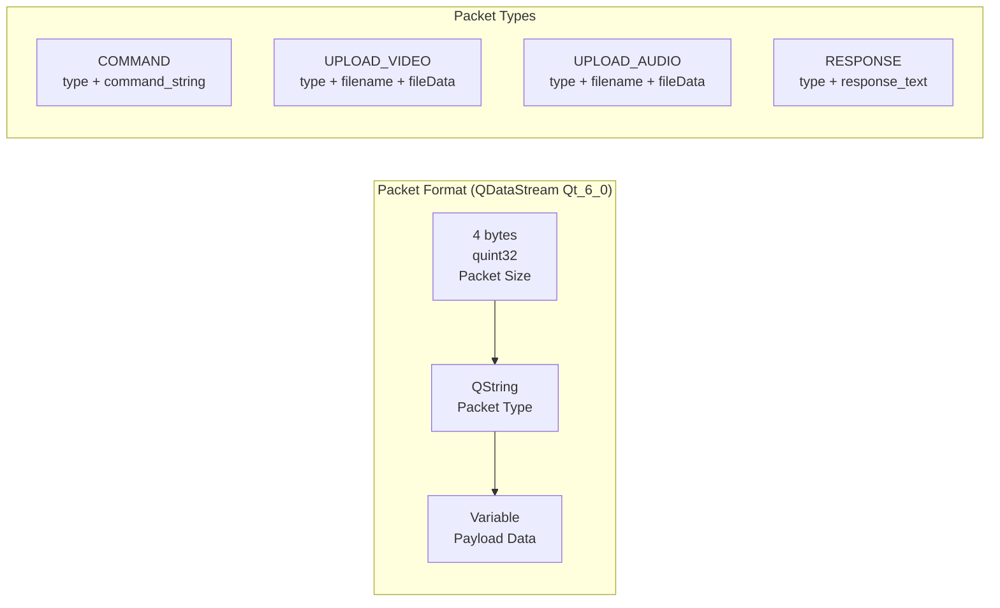

---

## 7. Media Command Flow (SSL Server)

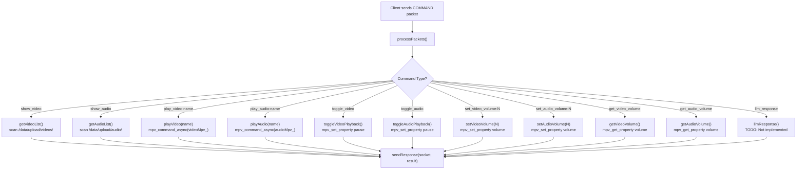

---

## 8. File Upload Flow (SSL Server)

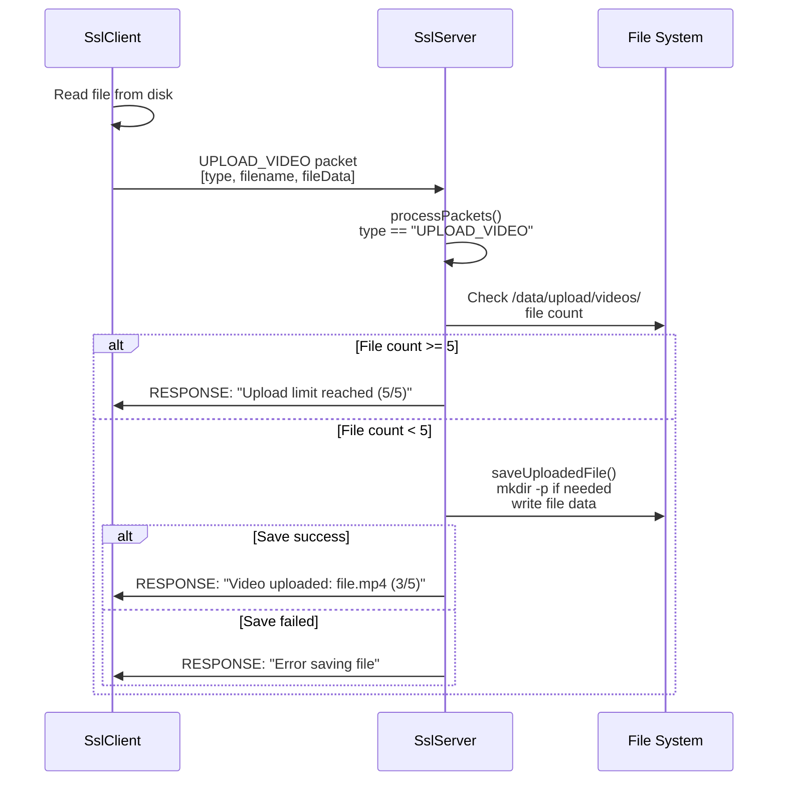

---

## 9. WiFi Configuration Flow

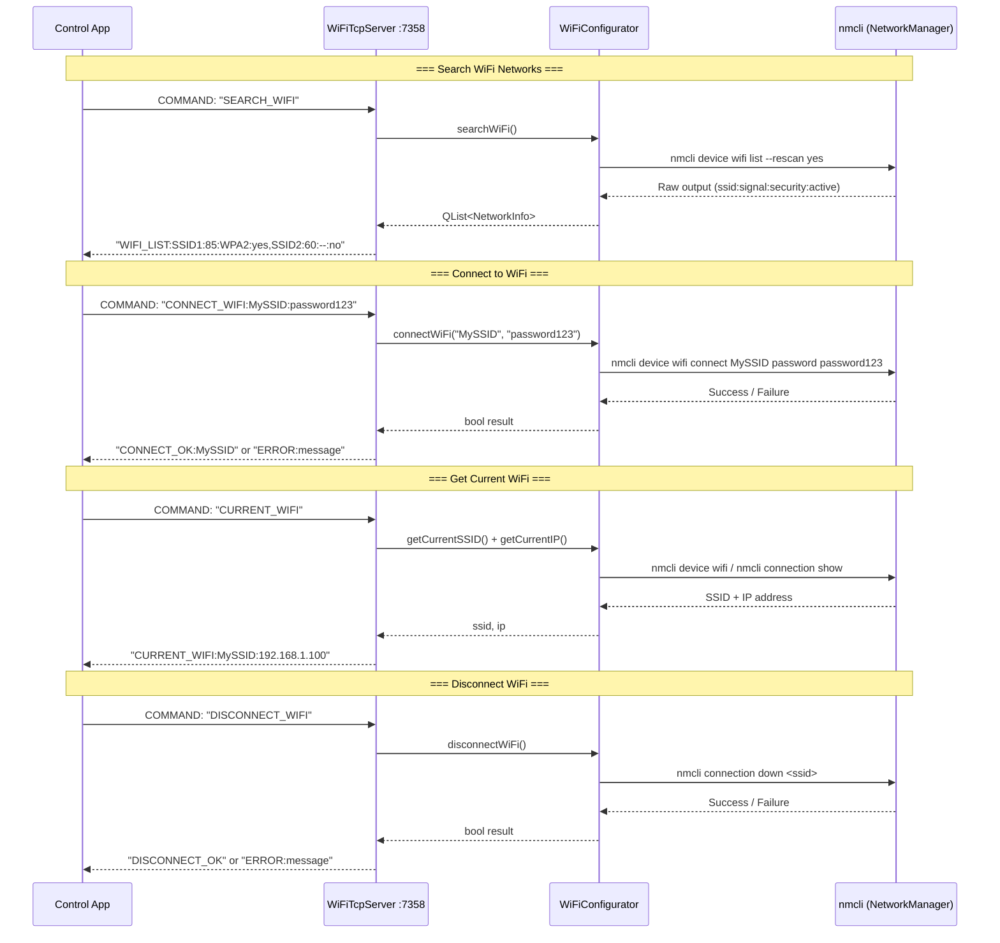

---

## 10. Network Topology

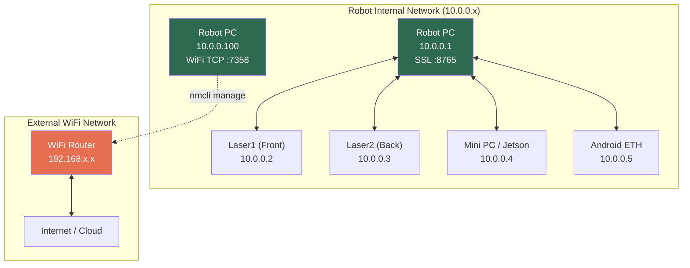

---

## 11. Complete Data Flow Summary

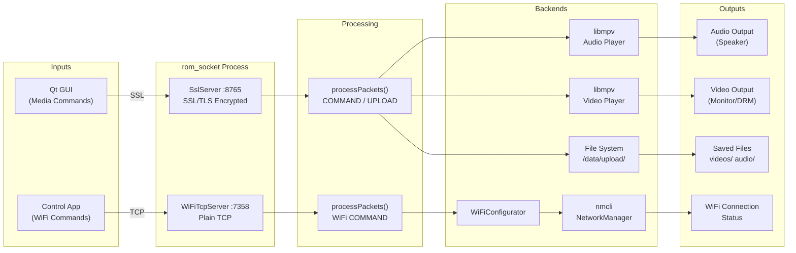

---

## Function Reference Table

| Server | Command | Function Called | Description |
|--------|---------|---------------|-------------|
| SSL :8765 | `show_video` | `getVideoList()` | Video file list ပြန်ပေးသည် |
| SSL :8765 | `show_audio` | `getAudioList()` | Audio file list ပြန်ပေးသည် |
| SSL :8765 | `play_video:<name>` | `playVideo()` | MPV ဖြင့် video ဖွင့်သည် |
| SSL :8765 | `play_audio:<name>` | `playAudio()` | MPV ဖြင့် audio ဖွင့်သည် |
| SSL :8765 | `toggle_video` | `toggleVideoPlayback()` | Video ရပ်/ဆက်ဖွင့် |
| SSL :8765 | `toggle_audio` | `toggleAudioPlayback()` | Audio ရပ်/ဆက်ဖွင့် |
| SSL :8765 | `set_video_volume:<N>` | `setVideoVolume()` | Video volume (0-100) |
| SSL :8765 | `set_audio_volume:<N>` | `setAudioVolume()` | Audio volume (0-100) |
| SSL :8765 | `get_video_volume` | `getVideoVolume()` | Video volume ပြန်ဖတ် |
| SSL :8765 | `get_audio_volume` | `getAudioVolume()` | Audio volume ပြန်ဖတ် |
| SSL :8765 | `UPLOAD_VIDEO` | `saveUploadedFile()` | Video file upload (max 5) |
| SSL :8765 | `UPLOAD_AUDIO` | `saveUploadedFile()` | Audio file upload (max 10) |
| SSL :8765 | `llm_response` | `llmResponse()` | TODO: LLM integration |
| WiFi :7358 | `SEARCH_WIFI` | `handleSearchWiFi()` | WiFi network scan |
| WiFi :7358 | `CONNECT_WIFI:<ssid>:<pwd>` | `handleConnectWiFi()` | WiFi connect |
| WiFi :7358 | `DISCONNECT_WIFI` | `handleDisconnectWiFi()` | WiFi disconnect |
| WiFi :7358 | `CURRENT_WIFI` | `handleCurrentWiFi()` | Current WiFi info |
