# Kotlin Android App ↔ rom_socket SSL Connection

Kotlin Android App (`com.romdynamics.delige`) နှင့် rom_socket C++ SSL Server တို့ ချိတ်ဆက်ပုံကို ဖော်ပြထားပါသည်။

---

## 1. System Overview

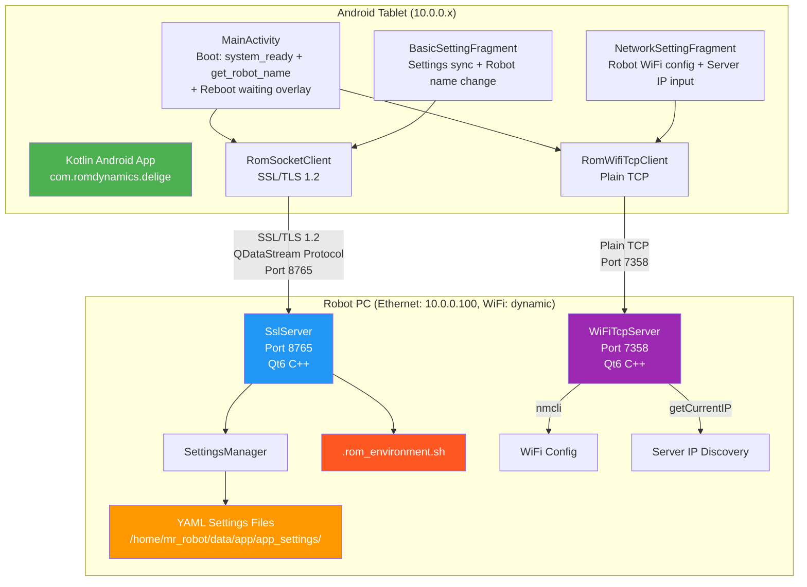
```mermaid
graph TB
    subgraph "Android Tablet (10.0.0.x)"
        APP["Kotlin Android App<br/>com.romdynamics.delige"]
        MA["MainActivity<br/>Boot: system_ready + get_robot_name<br/>+ Reboot waiting overlay"]
        BSF["BasicSettingFragment<br/>Settings sync + Robot name change"]
        NSF["NetworkSettingFragment<br/>Robot WiFi config + Server IP input"]
        RSC["RomSocketClient<br/>SSL/TLS 1.2"]
        RWTC["RomWifiTcpClient<br/>Plain TCP"]
        MA --> RSC
        MA --> RWTC
        BSF --> RSC
        NSF --> RWTC
    end

    subgraph "Robot PC (Ethernet: 10.0.0.100, WiFi: dynamic)"
        SS["SslServer<br/>Port 8765<br/>Qt6 C++"]
        WTS["WiFiTcpServer<br/>Port 7358<br/>Qt6 C++"]
        SM["SettingsManager"]
        ENV[".rom_environment.sh"]
        YAML["YAML Settings Files<br/>/home/mr_robot/data/app/app_settings/"]
        SS --> SM --> YAML
        SS --> ENV
        WTS --> |nmcli| WIFI["WiFi Config"]
        WTS --> |getCurrentIP| IPDISC["Server IP Discovery"]
    end

    RSC -- "SSL/TLS 1.2<br/>QDataStream Protocol<br/>Port 8765" --> SS
    RWTC -- "Plain TCP<br/>Port 7358" --> WTS

    style APP fill:#4CAF50,color:#fff
    style SS fill:#2196F3,color:#fff
    style WTS fill:#9C27B0,color:#fff
    style YAML fill:#FF9800,color:#fff
    style ENV fill:#FF5722,color:#fff
```

---

## 2. Class Diagram

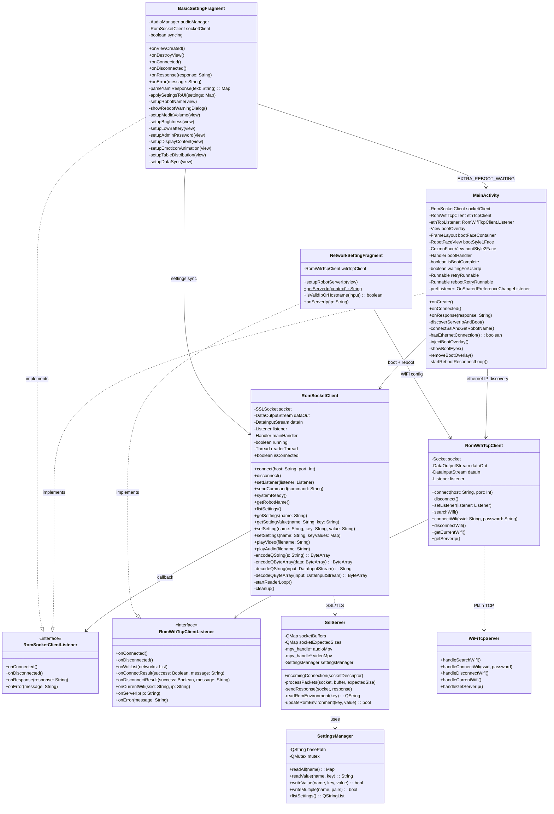
```mermaid
classDiagram
    class RomSocketClient {
        -SSLSocket socket
        -DataOutputStream dataOut
        -DataInputStream dataIn
        -Listener listener
        -Handler mainHandler
        -boolean running
        -Thread readerThread
        +boolean isConnected
        +connect(host: String, port: Int)
        +disconnect()
        +setListener(listener: Listener)
        +sendCommand(command: String)
        +systemReady()
        +getRobotName()
        +listSettings()
        +getSettings(name: String)
        +getSettingValue(name: String, key: String)
        +setSetting(name: String, key: String, value: String)
        +setSettings(name: String, keyValues: Map)
        +playVideo(filename: String)
        +playAudio(filename: String)
        -encodeQString(s: String): ByteArray
        -encodeQByteArray(data: ByteArray): ByteArray
        -decodeQString(input: DataInputStream): String
        -decodeQByteArray(input: DataInputStream): ByteArray
        -startReaderLoop()
        -cleanup()
    }

    class RomSocketClientListener {
        <<interface>>
        +onConnected()
        +onDisconnected()
        +onResponse(response: String)
        +onError(message: String)
    }

    class RomWifiTcpClient {
        -Socket socket
        -DataOutputStream dataOut
        -DataInputStream dataIn
        -Listener listener
        +connect(host: String, port: Int)
        +disconnect()
        +setListener(listener: Listener)
        +searchWifi()
        +connectWifi(ssid: String, password: String)
        +disconnectWifi()
        +getCurrentWifi()
        +getServerIp()
    }

    class RomWifiTcpClientListener {
        <<interface>>
        +onConnected()
        +onDisconnected()
        +onWifiList(networks: List)
        +onConnectResult(success: Boolean, message: String)
        +onDisconnectResult(success: Boolean, message: String)
        +onCurrentWifi(ssid: String, ip: String)
        +onServerIp(ip: String)
        +onError(message: String)
    }

    class MainActivity {
        -RomSocketClient socketClient
        -RomWifiTcpClient ethTcpClient
        -ethTcpListener: RomWifiTcpClient.Listener
        -View bootOverlay
        -FrameLayout bootFaceContainer
        -RobotFaceView bootStyle1Face
        -CozmoFaceView bootStyle2Face
        -Handler bootHandler
        -boolean isBootComplete
        -boolean waitingForUserIp
        -Runnable retryRunnable
        -Runnable rebootRetryRunnable
        -prefListener: OnSharedPreferenceChangeListener
        +onCreate()
        +onConnected()
        +onResponse(response: String)
        -discoverServerIpAndBoot()
        -connectSslAndGetRobotName()
        -hasEthernetConnection(): boolean
        -injectBootOverlay()
        -showBootEyes()
        -removeBootOverlay()
        -startRebootReconnectLoop()
    }

    class BasicSettingFragment {
        -AudioManager audioManager
        -RomSocketClient socketClient
        -boolean syncing
        +onViewCreated()
        +onDestroyView()
        +onConnected()
        +onDisconnected()
        +onResponse(response: String)
        +onError(message: String)
        -parseYamlResponse(text: String): Map
        -applySettingsToUI(settings: Map)
        -setupRobotName(view)
        -showRebootWarningDialog()
        -setupMediaVolume(view)
        -setupBrightness(view)
        -setupLowBattery(view)
        -setupAdminPassword(view)
        -setupDisplayContent(view)
        -setupEmoticonAnimation(view)
        -setupTableDistribution(view)
        -setupDataSync(view)
    }

    class NetworkSettingFragment {
        -RomWifiTcpClient wifiTcpClient
        +setupRobotServerIp(view)
        +getServerIp(context)$ String
        +isValidIpOrHostname(input): boolean
        +onServerIp(ip: String)
    }

    class SslServer {
        -QMap socketBuffers
        -QMap socketExpectedSizes
        -mpv_handle* audioMpv
        -mpv_handle* videoMpv
        -SettingsManager settingsManager
        +incomingConnection(socketDescriptor)
        -processPackets(socket, buffer, expectedSize)
        -sendResponse(socket, response)
        -readRomEnvironment(key): QString
        -updateRomEnvironment(key, value): bool
    }

    class WiFiTcpServer {
        +handleSearchWifi()
        +handleConnectWifi(ssid, password)
        +handleDisconnectWifi()
        +handleCurrentWifi()
        +handleGetServerIp()
    }

    class SettingsManager {
        -QString basePath
        -QMutex mutex
        +readAll(name): Map
        +readValue(name, key): String
        +writeValue(name, key, value): bool
        +writeMultiple(name, pairs): bool
        +listSettings(): QStringList
    }

    RomSocketClient --> RomSocketClientListener : callback
    RomWifiTcpClient --> RomWifiTcpClientListener : callback
    MainActivity ..|> RomSocketClientListener : implements
    BasicSettingFragment ..|> RomSocketClientListener : implements
    NetworkSettingFragment ..|> RomWifiTcpClientListener : implements
    MainActivity --> RomSocketClient : boot + reboot
    MainActivity --> RomWifiTcpClient : ethernet IP discovery
    BasicSettingFragment --> RomSocketClient : settings sync
    BasicSettingFragment --> MainActivity : EXTRA_REBOOT_WAITING
    NetworkSettingFragment --> RomWifiTcpClient : WiFi config
    SslServer --> SettingsManager : uses
    RomSocketClient ..> SslServer : SSL/TLS
    RomWifiTcpClient ..> WiFiTcpServer : Plain TCP
```

---

## 3. Connection Lifecycle

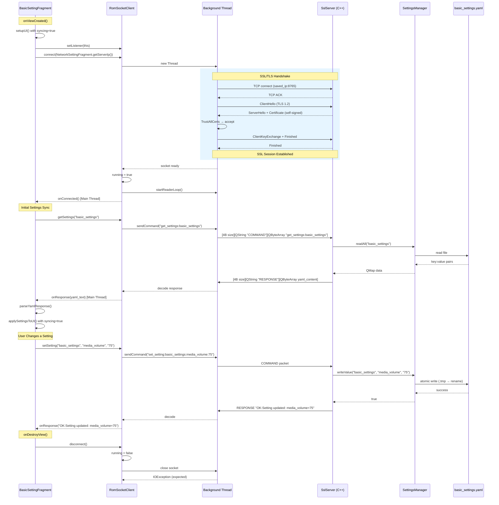
```mermaid
sequenceDiagram
    participant UI as BasicSettingFragment
    participant Client as RomSocketClient
    participant Thread as Background Thread
    participant Server as SslServer (C++)
    participant SM as SettingsManager
    participant YAML as basic_settings.yaml

    Note over UI: onViewCreated()
    UI->>UI: setupUI() with syncing=true
    UI->>Client: setListener(this)
    UI->>Client: connect(NetworkSettingFragment.getServerIp())

    Client->>Thread: new Thread

    rect rgb(230, 245, 255)
        Note over Thread,Server: SSL/TLS Handshake
        Thread->>Server: TCP connect (saved_ip:8765)
        Server-->>Thread: TCP ACK
        Thread->>Server: ClientHello (TLS 1.2)
        Server-->>Thread: ServerHello + Certificate (self-signed)
        Thread->>Thread: TrustAllCerts → accept
        Thread->>Server: ClientKeyExchange + Finished
        Server-->>Thread: Finished
        Note over Thread,Server: SSL Session Established
    end

    Thread-->>Client: socket ready
    Client->>Client: running = true
    Client->>Thread: startReaderLoop()
    Client-->>UI: onConnected() [Main Thread]

    Note over UI: Initial Settings Sync
    UI->>Client: getSettings("basic_settings")
    Client->>Thread: sendCommand("get_settings:basic_settings")
    Thread->>Server: [4B size][QString "COMMAND"][QByteArray "get_settings:basic_settings"]
    Server->>SM: readAll("basic_settings")
    SM->>YAML: read file
    YAML-->>SM: key:value pairs
    SM-->>Server: QMap data
    Server->>Thread: [4B size][QString "RESPONSE"][QByteArray yaml_content]
    Thread-->>Client: decode response
    Client-->>UI: onResponse(yaml_text) [Main Thread]
    UI->>UI: parseYamlResponse()
    UI->>UI: applySettingsToUI() with syncing=true

    Note over UI: User Changes a Setting
    UI->>Client: setSetting("basic_settings", "media_volume", "75")
    Client->>Thread: sendCommand("set_setting:basic_settings:media_volume:75")
    Thread->>Server: COMMAND packet
    Server->>SM: writeValue("basic_settings", "media_volume", "75")
    SM->>YAML: atomic write (.tmp → rename)
    YAML-->>SM: success
    SM-->>Server: true
    Server->>Thread: RESPONSE "OK:Setting updated: media_volume=75"
    Thread-->>Client: decode
    Client-->>UI: onResponse("OK:Setting updated: media_volume=75")

    Note over UI: onDestroyView()
    UI->>Client: disconnect()
    Client->>Client: running = false
    Client->>Thread: close socket
    Thread-->>Client: IOException (expected)
```

---

## 4. QDataStream Packet Protocol

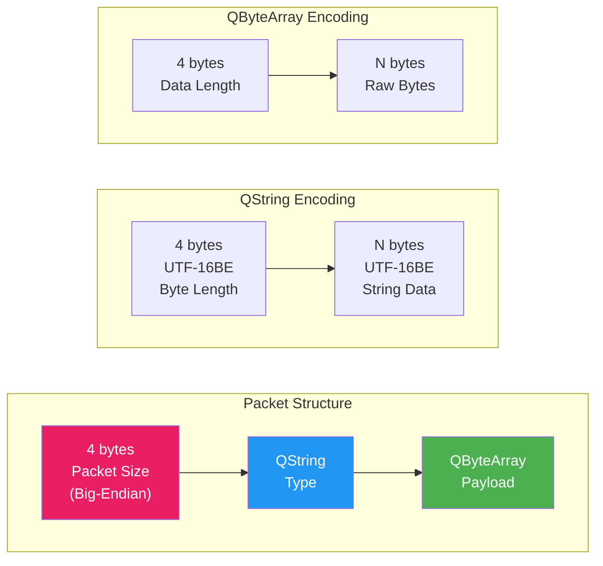
```mermaid
graph LR
    subgraph "Packet Structure"
        direction LR
        H["4 bytes<br/>Packet Size<br/>(Big-Endian)"]
        T["QString<br/>Type"]
        P["QByteArray<br/>Payload"]
        H --> T --> P
    end

    subgraph "QString Encoding"
        direction LR
        QL["4 bytes<br/>UTF-16BE<br/>Byte Length"]
        QD["N bytes<br/>UTF-16BE<br/>String Data"]
        QL --> QD
    end

    subgraph "QByteArray Encoding"
        direction LR
        BL["4 bytes<br/>Data Length"]
        BD["N bytes<br/>Raw Bytes"]
        BL --> BD
    end

    style H fill:#E91E63,color:#fff
    style T fill:#2196F3,color:#fff
    style P fill:#4CAF50,color:#fff
```

### Packet Example: `set_setting:basic_settings:media_volume:75`

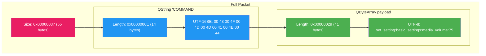
```mermaid
graph TD
    subgraph "Full Packet"
        SIZE["Size: 0x00000037 (55 bytes)"]
        subgraph "QString 'COMMAND'"
            TLEN["Length: 0x0000000E (14 bytes)"]
            TDATA["UTF-16BE: 00 43 00 4F 00 4D 00 4D 00 41 00 4E 00 44"]
        end
        subgraph "QByteArray payload"
            PLEN["Length: 0x00000029 (41 bytes)"]
            PDATA["UTF-8: set_setting:basic_settings:media_volume:75"]
        end
    end

    SIZE --> TLEN --> TDATA --> PLEN --> PDATA

    style SIZE fill:#E91E63,color:#fff
    style TLEN fill:#2196F3,color:#fff
    style TDATA fill:#2196F3,color:#fff
    style PLEN fill:#4CAF50,color:#fff
    style PDATA fill:#4CAF50,color:#fff
```

---

## 5. Kotlin Encoding / Decoding Flow


```mermaid
flowchart TD
    subgraph "Send (Kotlin → C++)"
        S1["sendCommand('get_settings:basic_settings')"]
        S2["encodeQString('COMMAND')<br/>'COMMAND' → UTF-16BE bytes<br/>prepend 4B length"]
        S3["encodeQByteArray(command.utf8)<br/>command → UTF-8 bytes<br/>prepend 4B length"]
        S4["packet = typeBytes + dataBytes"]
        S5["writeInt(packet.size)<br/>write(packet)<br/>flush()"]
        S1 --> S2 --> S3 --> S4 --> S5
    end

    subgraph "Receive (C++ → Kotlin)"
        R1["readInt() → packetSize"]
        R2["readFully(packetBuf)"]
        R3["decodeQString(stream) → type"]
        R4{"type == 'RESPONSE'?"}
        R5["decodeQByteArray(stream) → responseBytes"]
        R6["String(responseBytes, UTF-8) → response"]
        R7["mainHandler.post → onResponse(response)"]
        R8["Log warning: unknown type"]
        R1 --> R2 --> R3 --> R4
        R4 -- Yes --> R5 --> R6 --> R7
        R4 -- No --> R8
    end

    style S1 fill:#4CAF50,color:#fff
    style R7 fill:#2196F3,color:#fff
```

---

## 6. Threading Model

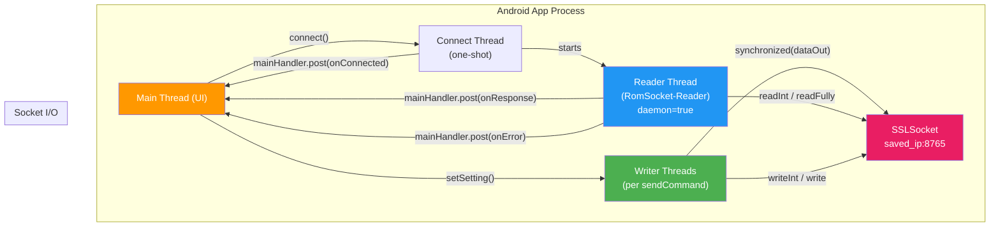
```mermaid
graph TB
    subgraph "Android App Process"
        MT["Main Thread (UI)"]
        CT["Connect Thread<br/>(one-shot)"]
        RT["Reader Thread<br/>(RomSocket-Reader)<br/>daemon=true"]
        WT["Writer Threads<br/>(per sendCommand)"]

        MT -- "connect()" --> CT
        CT -- "mainHandler.post(onConnected)" --> MT
        CT -- "starts" --> RT
        RT -- "mainHandler.post(onResponse)" --> MT
        RT -- "mainHandler.post(onError)" --> MT
        MT -- "setSetting()" --> WT
        WT -- "synchronized(dataOut)" --> SOCKET
    end

    subgraph "Socket I/O"
        SOCKET["SSLSocket<br/>saved_ip:8765"]
        RT -- "readInt / readFully" --> SOCKET
        WT -- "writeInt / write" --> SOCKET
    end

    style MT fill:#FF9800,color:#fff
    style RT fill:#2196F3,color:#fff
    style WT fill:#4CAF50,color:#fff
    style SOCKET fill:#E91E63,color:#fff
```

---

## 7. Settings Sync Flow (BasicSettingFragment)

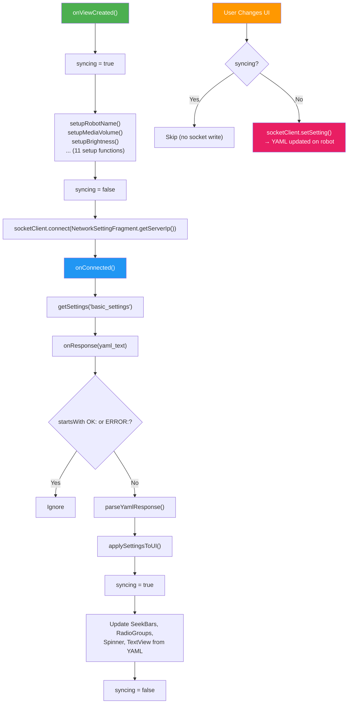
```mermaid
flowchart TD
    A["onViewCreated()"] --> B["syncing = true"]
    B --> C["setupRobotName()<br/>setupMediaVolume()<br/>setupBrightness()<br/>... (11 setup functions)"]
    C --> D["syncing = false"]
    D --> E["socketClient.connect(NetworkSettingFragment.getServerIp())"]
    E --> F["onConnected()"]
    F --> G["getSettings('basic_settings')"]
    G --> H["onResponse(yaml_text)"]
    H --> I{"startsWith OK: or ERROR:?"}
    I -- Yes --> J["Ignore"]
    I -- No --> K["parseYamlResponse()"]
    K --> L["applySettingsToUI()"]
    L --> M["syncing = true"]
    M --> N["Update SeekBars, RadioGroups,<br/>Spinner, TextView from YAML"]
    N --> O["syncing = false"]

    P["User Changes UI"] --> Q{"syncing?"}
    Q -- Yes --> R["Skip (no socket write)"]
    Q -- No --> S["socketClient.setSetting()<br/>→ YAML updated on robot"]

    style A fill:#4CAF50,color:#fff
    style F fill:#2196F3,color:#fff
    style P fill:#FF9800,color:#fff
    style S fill:#E91E63,color:#fff
```

---

## 8. Settings Key ↔ UI Component Mapping

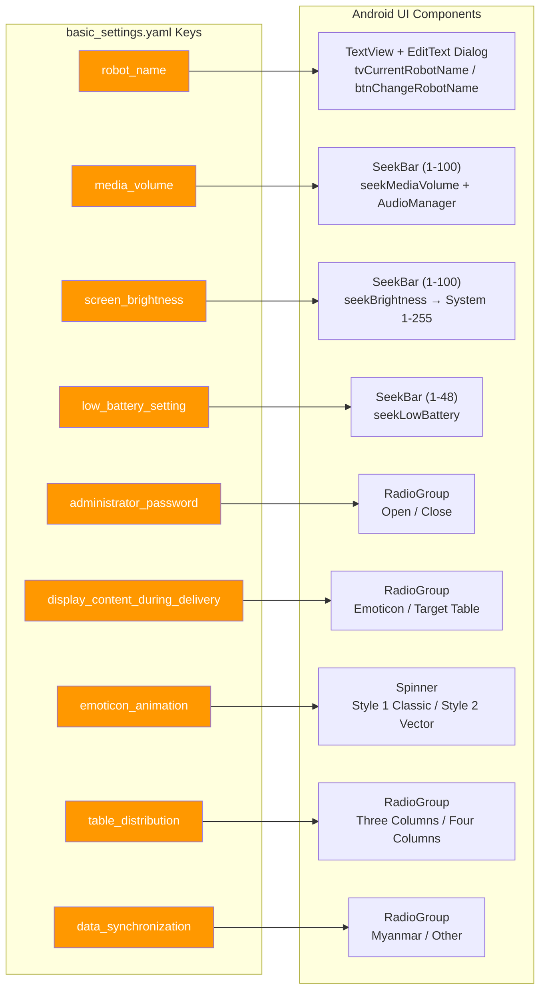
```mermaid
graph LR
    subgraph "basic_settings.yaml Keys"
        K1["robot_name"]
        K2["media_volume"]
        K3["screen_brightness"]
        K4["low_battery_setting"]
        K5["administrator_password"]
        K6["display_content_during_delivery"]
        K7["emoticon_animation"]
        K8["table_distribution"]
        K9["data_synchronization"]
    end

    subgraph "Android UI Components"
        U1["TextView + EditText Dialog<br/>tvCurrentRobotName / btnChangeRobotName"]
        U2["SeekBar (1-100)<br/>seekMediaVolume + AudioManager"]
        U3["SeekBar (1-100)<br/>seekBrightness → System 1-255"]
        U4["SeekBar (1-48)<br/>seekLowBattery"]
        U5["RadioGroup<br/>Open / Close"]
        U6["RadioGroup<br/>Emoticon / Target Table"]
        U7["Spinner<br/>Style 1 Classic / Style 2 Vector"]
        U8["RadioGroup<br/>Three Columns / Four Columns"]
        U9["RadioGroup<br/>Myanmar / Other"]
    end

    K1 --> U1
    K2 --> U2
    K3 --> U3
    K4 --> U4
    K5 --> U5
    K6 --> U6
    K7 --> U7
    K8 --> U8
    K9 --> U9

    style K1 fill:#FF9800,color:#fff
    style K2 fill:#FF9800,color:#fff
    style K3 fill:#FF9800,color:#fff
    style K4 fill:#FF9800,color:#fff
    style K5 fill:#FF9800,color:#fff
    style K6 fill:#FF9800,color:#fff
    style K7 fill:#FF9800,color:#fff
    style K8 fill:#FF9800,color:#fff
    style K9 fill:#FF9800,color:#fff
```

---

## 9. Error Handling & Reconnection

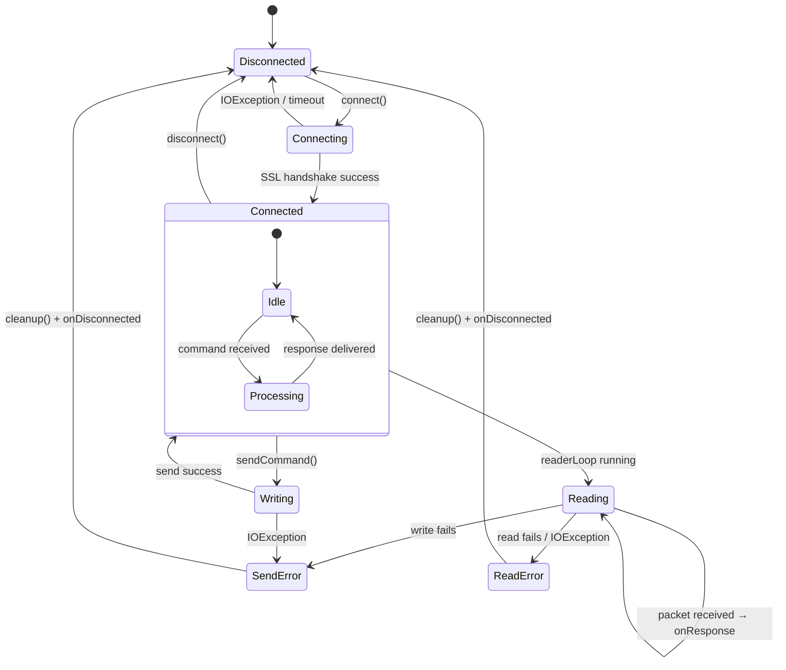
```mermaid
stateDiagram-v2
    [*] --> Disconnected

    Disconnected --> Connecting : connect()
    Connecting --> Connected : SSL handshake success
    Connecting --> Disconnected : IOException / timeout

    Connected --> Reading : readerLoop running
    Reading --> Reading : packet received → onResponse
    Reading --> SendError : write fails
    Reading --> ReadError : read fails / IOException

    Connected --> Writing : sendCommand()
    Writing --> Connected : send success
    Writing --> SendError : IOException

    SendError --> Disconnected : cleanup() + onDisconnected
    ReadError --> Disconnected : cleanup() + onDisconnected

    Connected --> Disconnected : disconnect()

    state Connected {
        [*] --> Idle
        Idle --> Processing : command received
        Processing --> Idle : response delivered
    }
```

---

## 10. Network Topology

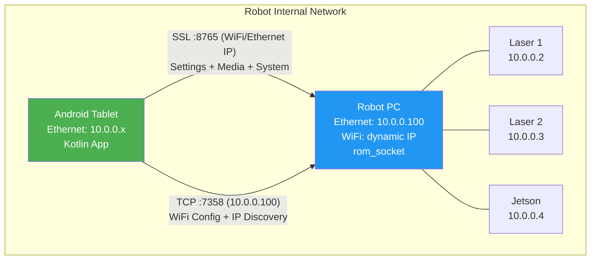
```mermaid
graph TB
    subgraph "Robot Internal Network"
        PC["Robot PC<br/>Ethernet: 10.0.0.100<br/>WiFi: dynamic IP<br/>rom_socket"]
        ANDROID["Android Tablet<br/>Ethernet: 10.0.0.x<br/>Kotlin App"]
        LASER1["Laser 1<br/>10.0.0.2"]
        LASER2["Laser 2<br/>10.0.0.3"]
        JETSON["Jetson<br/>10.0.0.4"]
    end

    ANDROID -- "SSL :8765 (WiFi/Ethernet IP)<br/>Settings + Media + System" --> PC
    ANDROID -- "TCP :7358 (10.0.0.100)<br/>WiFi Config + IP Discovery" --> PC
    PC --- LASER1
    PC --- LASER2
    PC --- JETSON

    style PC fill:#2196F3,color:#fff
    style ANDROID fill:#4CAF50,color:#fff
```

---

## 11. File Structure

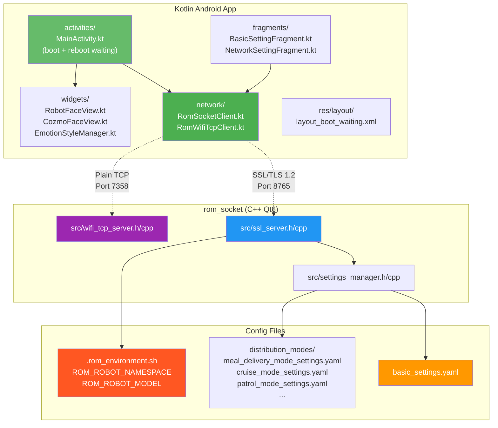
```mermaid
graph TB
    subgraph "Kotlin Android App"
        ACT["activities/<br/>MainActivity.kt<br/>(boot + reboot waiting)"]
        NET["network/<br/>RomSocketClient.kt<br/>RomWifiTcpClient.kt"]
        FRAG["fragments/<br/>BasicSettingFragment.kt<br/>NetworkSettingFragment.kt"]
        WID["widgets/<br/>RobotFaceView.kt<br/>CozmoFaceView.kt<br/>EmotionStyleManager.kt"]
        LAY["res/layout/<br/>layout_boot_waiting.xml"]
        ACT --> NET
        ACT --> WID
        FRAG --> NET
    end

    subgraph "rom_socket (C++ Qt6)"
        SSL["src/ssl_server.h/cpp"]
        WTCP["src/wifi_tcp_server.h/cpp"]
        SMGR["src/settings_manager.h/cpp"]
        SSL --> SMGR
    end

    subgraph "Config Files"
        BS["basic_settings.yaml"]
        ENV[".rom_environment.sh<br/>ROM_ROBOT_NAMESPACE<br/>ROM_ROBOT_MODEL"]
        DIST["distribution_modes/<br/>meal_delivery_mode_settings.yaml<br/>cruise_mode_settings.yaml<br/>patrol_mode_settings.yaml<br/>..."]
    end

    NET -. "SSL/TLS 1.2<br/>Port 8765" .-> SSL
    NET -. "Plain TCP<br/>Port 7358" .-> WTCP
    SMGR --> BS
    SMGR --> DIST
    SSL --> ENV

    style NET fill:#4CAF50,color:#fff
    style ACT fill:#66BB6A,color:#fff
    style SSL fill:#2196F3,color:#fff
    style WTCP fill:#9C27B0,color:#fff
    style BS fill:#FF9800,color:#fff
    style ENV fill:#FF5722,color:#fff
```

---

## Quick Reference

| Item | Detail |
|------|--------|
| **SSL Server** | `SslServer` (C++ Qt6) — `0.0.0.0:8765` (QHostAddress::Any) |
| **TCP Server** | `WiFiTcpServer` (C++ Qt6) — `10.0.0.100:7358` |
| **SSL Client** | `RomSocketClient` (Kotlin) — `javax.net.ssl.SSLSocket` |
| **TCP Client** | `RomWifiTcpClient` (Kotlin) — `java.net.Socket` |
| **Protocol** | QDataStream Qt_6_0: `[4B size] + [QString type] + [QByteArray payload]` |
| **TLS** | TLS 1.2, self-signed RSA 2048 cert (CN=GhostMan) |
| **Cert Trust** | `TrustAllCerts` (accept self-signed) |
| **Settings File** | `basic_settings.yaml` at `/home/mr_robot/data/app/app_settings/` |
| **Environment** | `.rom_environment.sh` at `/home/mr_robot/data/systemd/` |
| **Server IP** | Saved in SharedPreferences `robot_prefs` → key `robot_server_ip` (default `10.0.0.1`) |
| **Boot Command** | `system_ready` → `"OK"` |
| **Name Command** | `get_robot_name` → `"ROBOT_NAME:<namespace>"` |
| **Read Command** | `get_settings:basic_settings` → full YAML content |
| **Write Command** | `set_setting:basic_settings:<key>:<value>` → `"OK:Setting updated: <key>=<value>"` |
| **WiFi Commands** | `SEARCH_WIFI`, `CONNECT_WIFI:ssid:pass`, `DISCONNECT_WIFI`, `CURRENT_WIFI` |
| **IP Discovery** | `GET_SERVER_IP` → `"SERVER_IP:<wifi_ip>"` (TCP port 7358) |
| **Threading** | Connect thread + Reader daemon thread + per-send writer threads |
| **UI Callback** | `Handler(Looper.getMainLooper())` — all callbacks on main thread |
| **Sync Guard** | `@Volatile syncing` flag prevents feedback loops |
| **Boot Retry** | Every 2s: disconnect → reconnect → system_ready → get_robot_name |
| **Reboot Retry** | Every 2s: ethernet TCP or SSL → system_ready → get_robot_name |
| **Boot Status UI** | tvRobotName shows: "connecting..." → "ethernet connected" / "add wifi ip" → robot name |
| **Reboot Overlay** | Robot eyes (CURIOUS) + speech bubble "Robot is booting, please wait.." |

---

## 12. Settings Retrieve Timing (YAML → UI)

Settings retrieve သည် **တစ်ကြိမ်တည်းသာ** ဖြစ်ပြီး `onConnected()` callback တွင်သာ ခေါ်ပါသည်။
Fragment ကို ပြန်ဖွင့်တိုင်း reconnect + re-retrieve ဖြစ်မည်။

| Step | Code | Timing |
|------|------|--------|
| 1 | `syncing = true` | UI setup မစခင် socket write suppress |
| 2 | `setupXxx()` x 11 functions | Local defaults (SharedPrefs, AudioManager, hardcoded) |
| 3 | `syncing = false` | Suppress ပြန်ဖွင့် |
| 4 | `connect(getServerIp())` | Background thread မှာ SSL connect |
| 5 | `onConnected()` → `getSettings("basic_settings")` | Connect ရပြီးမှ YAML request ပို့ |
| 6 | `onResponse()` → `applySettingsToUI()` | Response ပြန်ရမှ UI overwrite |

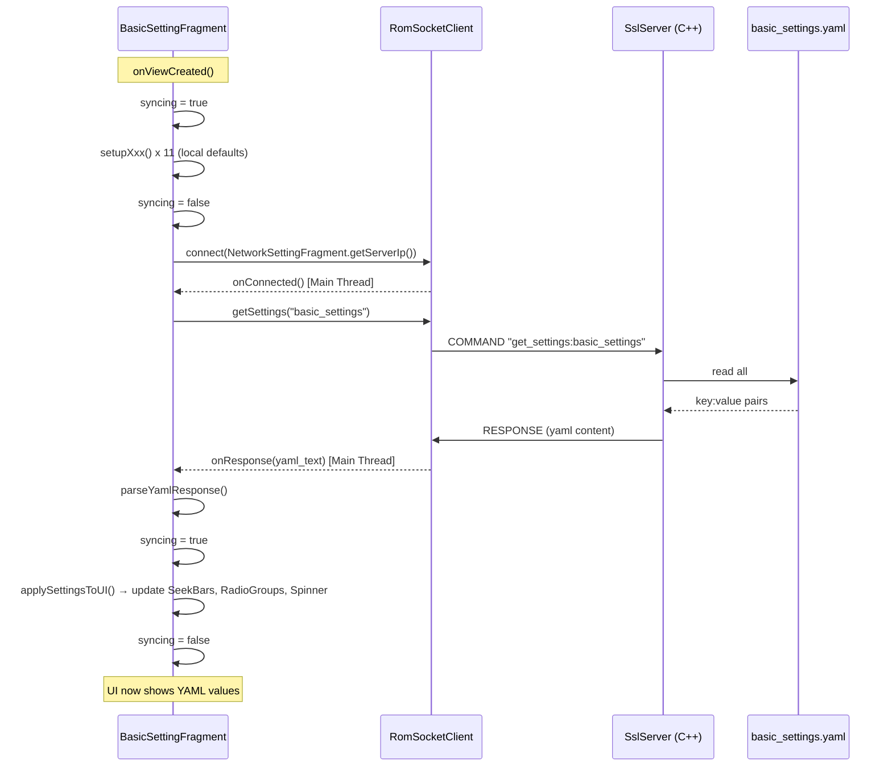
```mermaid
sequenceDiagram
    participant UI as BasicSettingFragment
    participant SC as RomSocketClient
    participant SS as SslServer (C++)
    participant YAML as basic_settings.yaml

    Note over UI: onViewCreated()
    UI->>UI: syncing = true
    UI->>UI: setupXxx() x 11 (local defaults)
    UI->>UI: syncing = false
    UI->>SC: connect(NetworkSettingFragment.getServerIp())
    SC-->>UI: onConnected() [Main Thread]
    UI->>SC: getSettings("basic_settings")
    SC->>SS: COMMAND "get_settings:basic_settings"
    SS->>YAML: read all
    YAML-->>SS: key:value pairs
    SS->>SC: RESPONSE (yaml content)
    SC-->>UI: onResponse(yaml_text) [Main Thread]
    UI->>UI: parseYamlResponse()
    UI->>UI: syncing = true
    UI->>UI: applySettingsToUI() → update SeekBars, RadioGroups, Spinner
    UI->>UI: syncing = false
    Note over UI: UI now shows YAML values
```

---

## 13. Settings Write Timing (UI → YAML)

User တိုင်း UI ပြောင်းလိုက်တာနဲ့ **ချက်ချင်း** `setSetting()` ခေါ်ပါသည်။
SeekBar များသည် `onStopTrackingTouch` (drag လွှတ်ချိန်) မှာသာ write လုပ်ပြီး +/- buttons များက click တိုင်း write လုပ်သည်။

| UI Component | Trigger Event | Write Timing |
|---|---|---|
| **Robot Name** | Dialog OK button click | Click time → **triggers reboot** |
| **Media Volume** SeekBar drag | `onStopTrackingTouch` | Drag release time |
| **Media Volume** +/- buttons | `onClick` | Each click |
| **Brightness** SeekBar drag | `onStopTrackingTouch` | Drag release time |
| **Brightness** +/- buttons | `onClick` | Each click |
| **Low Battery** SeekBar drag | `onStopTrackingTouch` | Drag release time |
| **Low Battery** +/- buttons | `onClick` | Each click |
| **Admin Password** | RadioButton checked | Select time |
| **Display Content** | RadioButton checked | Select time |
| **Emoticon Style** | Spinner item selected | Select time |
| **Table Distribution** | RadioButton checked | Select time |
| **Data Sync** | RadioButton checked | Select time |

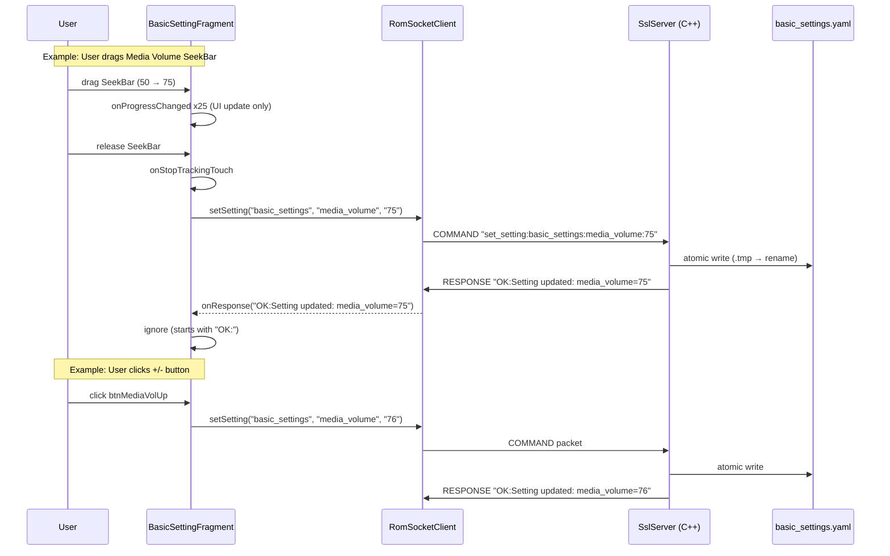
```mermaid
sequenceDiagram
    participant User
    participant UI as BasicSettingFragment
    participant SC as RomSocketClient
    participant SS as SslServer (C++)
    participant YAML as basic_settings.yaml

    Note over User,UI: Example: User drags Media Volume SeekBar
    User->>UI: drag SeekBar (50 → 75)
    UI->>UI: onProgressChanged x25 (UI update only)
    User->>UI: release SeekBar
    UI->>UI: onStopTrackingTouch
    UI->>SC: setSetting("basic_settings", "media_volume", "75")
    SC->>SS: COMMAND "set_setting:basic_settings:media_volume:75"
    SS->>YAML: atomic write (.tmp → rename)
    SS->>SC: RESPONSE "OK:Setting updated: media_volume=75"
    SC-->>UI: onResponse("OK:Setting updated: media_volume=75")
    UI->>UI: ignore (starts with "OK:")

    Note over User,UI: Example: User clicks +/- button
    User->>UI: click btnMediaVolUp
    UI->>SC: setSetting("basic_settings", "media_volume", "76")
    SC->>SS: COMMAND packet
    SS->>YAML: atomic write
    SS->>SC: RESPONSE "OK:Setting updated: media_volume=76"
```

---

## 14. syncing Flag Guard Logic

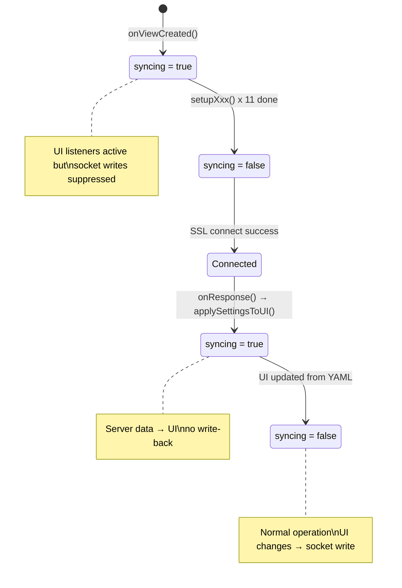
```mermaid
stateDiagram-v2
    [*] --> SyncingTrue : onViewCreated()

    state "syncing = true" as SyncingTrue
    state "syncing = false" as SyncingFalse
    state "syncing = true" as SyncingTrue2
    state "syncing = false" as SyncingFalse2

    SyncingTrue --> SyncingFalse : setupXxx() x 11 done
    SyncingFalse --> Connected : SSL connect success
    Connected --> SyncingTrue2 : onResponse() → applySettingsToUI()
    SyncingTrue2 --> SyncingFalse2 : UI updated from YAML

    note right of SyncingTrue : UI listeners active but\nsocket writes suppressed
    note right of SyncingTrue2 : Server data → UI\nno write-back
    note right of SyncingFalse2 : Normal operation\nUI changes → socket write
```

---

## 15. Boot Connection Flow (Normal Startup)

App ပထမဆုံးဖွင့်ချိန်တွင် MainActivity သည် server IP ကို discover လုပ်ပြီး SSL server ကို connect လုပ်သည်။

### Flow Steps

| Step | Condition | tvRobotName Text | Action |
|------|-----------|-----------------|--------|
| 1 | App starts | `"connecting to wifi server and ethernet ..."` | Check ethernet |
| 2a | Ethernet available | `"ethernet connected"` | TCP → GET_SERVER_IP → save IP |
| 2b | No ethernet + saved IP | - | SSL connect with saved IP |
| 2c | No ethernet + no saved IP | `"add wifi ip"` | Wait for user to save IP in Settings |
| 3 | IP obtained | - | SSL connect → system_ready → get_robot_name |
| 4 | Robot name received | `"<robot_name>"` | Boot complete |

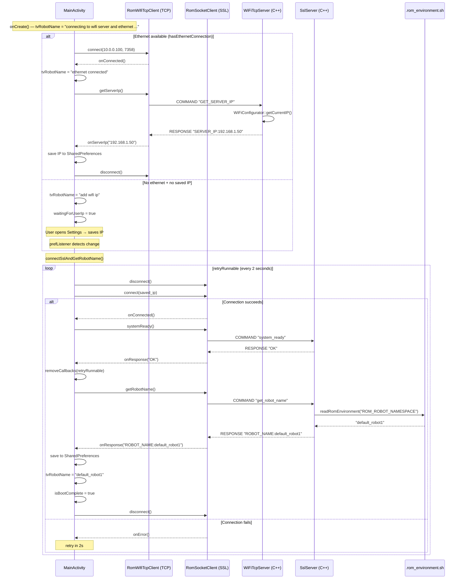
```mermaid
sequenceDiagram
    participant MA as MainActivity
    participant ETH as RomWifiTcpClient (TCP)
    participant SC as RomSocketClient (SSL)
    participant WTS as WiFiTcpServer (C++)
    participant SS as SslServer (C++)
    participant ENV as .rom_environment.sh

    Note over MA: onCreate() — tvRobotName = "connecting to wifi server and ethernet ..."

    alt Ethernet available (hasEthernetConnection)
        MA->>ETH: connect(10.0.0.100, 7358)
        ETH-->>MA: onConnected()
        MA->>MA: tvRobotName = "ethernet connected"
        MA->>ETH: getServerIp()
        ETH->>WTS: COMMAND "GET_SERVER_IP"
        WTS->>WTS: WiFiConfigurator::getCurrentIP()
        WTS-->>ETH: RESPONSE "SERVER_IP:192.168.1.50"
        ETH-->>MA: onServerIp("192.168.1.50")
        MA->>MA: save IP to SharedPreferences
        MA->>ETH: disconnect()
    else No ethernet + no saved IP
        MA->>MA: tvRobotName = "add wifi ip"
        MA->>MA: waitingForUserIp = true
        Note over MA: User opens Settings → saves IP
        Note over MA: prefListener detects change
    end

    Note over MA: connectSslAndGetRobotName()

    loop retryRunnable (every 2 seconds)
        MA->>SC: disconnect()
        MA->>SC: connect(saved_ip)

        alt Connection succeeds
            SC-->>MA: onConnected()
            MA->>SC: systemReady()
            SC->>SS: COMMAND "system_ready"
            SS-->>SC: RESPONSE "OK"
            SC-->>MA: onResponse("OK")
            MA->>MA: removeCallbacks(retryRunnable)
            MA->>SC: getRobotName()
            SC->>SS: COMMAND "get_robot_name"
            SS->>ENV: readRomEnvironment("ROM_ROBOT_NAMESPACE")
            ENV-->>SS: "default_robot1"
            SS-->>SC: RESPONSE "ROBOT_NAME:default_robot1"
            SC-->>MA: onResponse("ROBOT_NAME:default_robot1")
            MA->>MA: save to SharedPreferences
            MA->>MA: tvRobotName = "default_robot1"
            MA->>MA: isBootComplete = true
            MA->>SC: disconnect()
        else Connection fails
            SC-->>MA: onError()
            Note over MA: retry in 2s
        end
    end
```

---

## 16. Robot Name Change + Reboot Flow

Robot name ပြောင်းလိုက်ရင် server ဘက်မှာ YAML + `.rom_environment.sh` update ပြီး robot PC reboot လုပ်မည်။
Android app ဘက်မှာ reboot overlay ပြပြီး server ready ဖြစ်တဲ့အထိ 2 seconds တခါ retry လုပ်မည်။

### End-to-End Flow

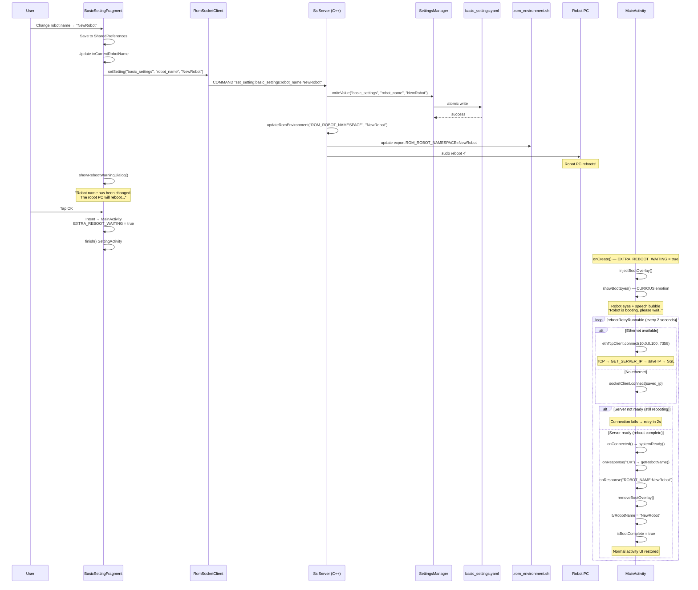
```mermaid
sequenceDiagram
    participant User
    participant BSF as BasicSettingFragment
    participant SC as RomSocketClient
    participant SS as SslServer (C++)
    participant SM as SettingsManager
    participant YAML as basic_settings.yaml
    participant ENV as .rom_environment.sh
    participant RPC as Robot PC

    User->>BSF: Change robot name → "NewRobot"
    BSF->>BSF: Save to SharedPreferences
    BSF->>BSF: Update tvCurrentRobotName
    BSF->>SC: setSetting("basic_settings", "robot_name", "NewRobot")
    SC->>SS: COMMAND "set_setting:basic_settings:robot_name:NewRobot"
    SS->>SM: writeValue("basic_settings", "robot_name", "NewRobot")
    SM->>YAML: atomic write
    YAML-->>SM: success
    SS->>SS: updateRomEnvironment("ROM_ROBOT_NAMESPACE", "NewRobot")
    SS->>ENV: update export ROM_ROBOT_NAMESPACE=NewRobot
    SS->>RPC: sudo reboot -f
    Note over RPC: Robot PC reboots!

    BSF->>BSF: showRebootWarningDialog()
    Note over BSF: "Robot name has been changed.<br/>The robot PC will reboot..."

    User->>BSF: Tap OK

    BSF->>BSF: Intent → MainActivity<br/>EXTRA_REBOOT_WAITING = true
    BSF->>BSF: finish() SettingActivity

    participant MA as MainActivity
    Note over MA: onCreate() — EXTRA_REBOOT_WAITING = true
    MA->>MA: injectBootOverlay()
    MA->>MA: showBootEyes() — CURIOUS emotion
    Note over MA: Robot eyes + speech bubble<br/>"Robot is booting, please wait.."

    loop rebootRetryRunnable (every 2 seconds)
        alt Ethernet available
            MA->>MA: ethTcpClient.connect(10.0.0.100, 7358)
            Note over MA: TCP → GET_SERVER_IP → save IP → SSL
        else No ethernet
            MA->>MA: socketClient.connect(saved_ip)
        end

        alt Server not ready (still rebooting)
            Note over MA: Connection fails → retry in 2s
        else Server ready (reboot complete)
            MA->>MA: onConnected() → systemReady()
            MA->>MA: onResponse("OK") → getRobotName()
            MA->>MA: onResponse("ROBOT_NAME:NewRobot")
            MA->>MA: removeBootOverlay()
            MA->>MA: tvRobotName = "NewRobot"
            MA->>MA: isBootComplete = true
            Note over MA: Normal activity UI restored
        end
    end
```

### Server-Side Name Change (ssl_server.cpp)

```cpp
// set_setting command handler
if (success && settingsName == "basic_settings" && key == "robot_name") {
    updateRomEnvironment("ROM_ROBOT_NAMESPACE", value);
    // updateRomEnvironment() calls:
    //   QProcess::execute("sudo", QStringList() << "reboot" << "-f");
}
```

### Reboot Overlay State Machine

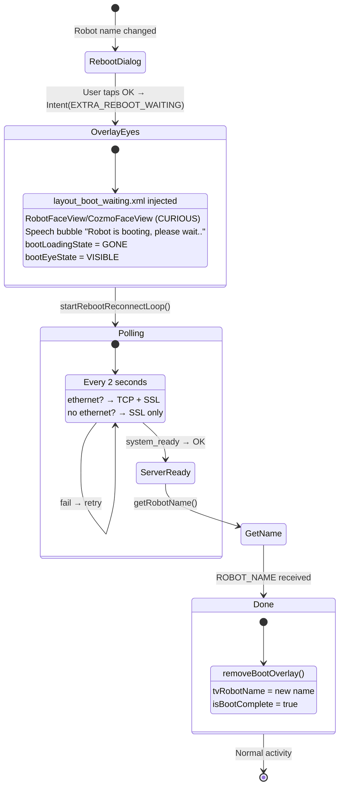
```mermaid
stateDiagram-v2
    [*] --> RebootDialog : Robot name changed

    RebootDialog --> OverlayEyes : User taps OK → Intent(EXTRA_REBOOT_WAITING)

    state OverlayEyes {
        [*] --> ShowEyes
        ShowEyes : layout_boot_waiting.xml injected
        ShowEyes : RobotFaceView/CozmoFaceView (CURIOUS)
        ShowEyes : Speech bubble "Robot is booting, please wait.."
        ShowEyes : bootLoadingState = GONE
        ShowEyes : bootEyeState = VISIBLE
    }

    OverlayEyes --> Polling : startRebootReconnectLoop()

    state Polling {
        [*] --> TryConnect
        TryConnect : Every 2 seconds
        TryConnect : ethernet? → TCP + SSL
        TryConnect : no ethernet? → SSL only
        TryConnect --> TryConnect : fail → retry
        TryConnect --> ServerReady : system_ready → OK
    }

    ServerReady --> GetName : getRobotName()
    GetName --> Done : ROBOT_NAME received

    state Done {
        [*] --> RemoveOverlay
        RemoveOverlay : removeBootOverlay()
        RemoveOverlay : tvRobotName = new name
        RemoveOverlay : isBootComplete = true
    }

    Done --> [*] : Normal activity
```

### Boot Overlay Layout Structure

```
layout_boot_waiting.xml
├── FrameLayout (bootWaitingOverlay) — fullscreen, elevation=100dp
│   ├── LinearLayout (bootLoadingState) — GONE during reboot wait
│   │   ├── ProgressBar (indeterminate, accent_blue)
│   │   └── TextView "Connecting to robot…"
│   └── FrameLayout (bootEyeState) — VISIBLE during reboot wait
│       ├── FrameLayout (bootFaceContainer)
│       │   └── RobotFaceView / CozmoFaceView (CURIOUS, autonomous)
│       └── TextView (bootSpeechBubble) — top center
│           "Robot is booting, please wait.."
```

---

## 17. All SSL Commands Reference

`RomSocketClient` မှ ပို့နိုင်သော SSL command များအားလုံး။

| Category | Command | Response | Used By |
|----------|---------|----------|---------|
| **System** | `system_ready` | `"OK"` | MainActivity |
| **System** | `get_robot_name` | `"ROBOT_NAME:<namespace>"` | MainActivity |
| **Settings** | `list_settings` | Comma-separated list | — |
| **Settings** | `get_settings:<name>` | YAML content | BasicSettingFragment |
| **Settings** | `get_setting_value:<name>:<key>` | `"VALUE:<value>"` | — |
| **Settings** | `set_setting:<name>:<key>:<value>` | `"OK:Setting updated: <key>=<value>"` | BasicSettingFragment |
| **Settings** | `set_settings:<name>:<pairs>` | `"OK:batch_write"` | — |
| **Media** | `show_video` | Video file list | — |
| **Media** | `show_audio` | Audio file list | — |
| **Media** | `play_video:<filename>` | `"PLAYING:video"` | — |
| **Media** | `play_audio:<filename>` | `"PLAYING:audio"` | — |
| **Media** | `toggle_video` | `"PAUSED"` / `"RESUMED"` | — |
| **Media** | `toggle_audio` | `"PAUSED"` / `"RESUMED"` | — |
| **Media** | `set_video_volume:<vol>` | `"OK"` | — |
| **Media** | `set_audio_volume:<vol>` | `"OK"` | — |
| **Media** | `get_video_volume` | `"VOLUME:<vol>"` | — |
| **Media** | `get_audio_volume` | `"VOLUME:<vol>"` | — |

### Special: `set_setting:basic_settings:robot_name:<value>`

⚠️ Robot name change triggers **robot PC reboot** via `sudo reboot -f`.
Server flow: `SettingsManager.writeValue()` → `updateRomEnvironment("ROM_ROBOT_NAMESPACE", value)` → `QProcess::execute("sudo", {"reboot", "-f"})`.

### TCP Commands (WiFi — Port 7358)

| Command | Response | Used By |
|---------|----------|---------|
| `SEARCH_WIFI` | `WIFI_LIST:<json_array>` | NetworkSettingFragment |
| `CONNECT_WIFI:<ssid>:<password>` | `CONNECT_OK` / `CONNECT_FAIL:<reason>` | NetworkSettingFragment |
| `DISCONNECT_WIFI` | `DISCONNECT_OK` | NetworkSettingFragment |
| `CURRENT_WIFI` | `CURRENT:<ssid>` / `CURRENT:NONE` | NetworkSettingFragment |
| `GET_SERVER_IP` | `SERVER_IP:<wifi_ip>` | MainActivity (ethernet discovery) |

---

## 18. Server IP Discovery Flow

App boot ချိန်တွင် Android tablet သည် ethernet TCP (10.0.0.100:7358) ကိုသုံးပြီး robot PC ရဲ့ WiFi IP ကို discover လုပ်သည်။ ဤ WiFi IP ကို SSL server connect ရာတွင် အသုံးပြုသည်။

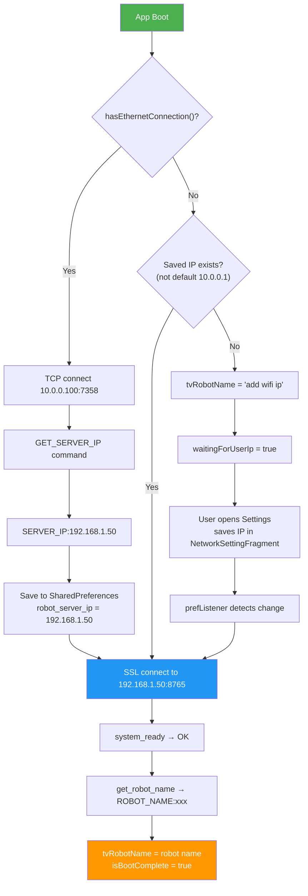
```mermaid
flowchart TD
    A["App Boot"] --> B{"hasEthernetConnection()?"}
    B -- Yes --> C["TCP connect 10.0.0.100:7358"]
    C --> D["GET_SERVER_IP command"]
    D --> E["SERVER_IP:192.168.1.50"]
    E --> F["Save to SharedPreferences<br/>robot_server_ip = 192.168.1.50"]
    F --> G["SSL connect to 192.168.1.50:8765"]

    B -- No --> H{"Saved IP exists?<br/>(not default 10.0.0.1)"}
    H -- Yes --> G
    H -- No --> I["tvRobotName = 'add wifi ip'"]
    I --> J["waitingForUserIp = true"]
    J --> K["User opens Settings<br/>saves IP in NetworkSettingFragment"]
    K --> L["prefListener detects change"]
    L --> G

    G --> M["system_ready → OK"]
    M --> N["get_robot_name → ROBOT_NAME:xxx"]
    N --> O["tvRobotName = robot name<br/>isBootComplete = true"]

    style A fill:#4CAF50,color:#fff
    style G fill:#2196F3,color:#fff
    style O fill:#FF9800,color:#fff
```

### SharedPreferences Keys

| Preferences Name | Key | Default | Purpose |
|-----------------|-----|---------|---------|
| `robot_prefs` | `robot_server_ip` | `"10.0.0.1"` | SSL server IP (saved from ethernet discovery or user input) |
| `robot_prefs` | `robot_name` | `"ROM-Robot"` | Cached robot name from server |
| `emotion_style_prefs` | `selected_style` | `0` (STYLE_1) | Eye animation style (Classic / Vector) |

---

## 19. Retry Mechanisms Summary

App တွင် retry runnable 2 ခု ရှိသည်:

| Runnable | Trigger | Interval | Targets | Stops When |
|----------|---------|----------|---------|------------|
| `retryRunnable` | Normal boot (connectSslAndGetRobotName) | 2 seconds | SSL only (saved IP) | `isBootComplete = true` |
| `rebootRetryRunnable` | After robot name change reboot | 2 seconds | Ethernet TCP + SSL | `isBootComplete = true` |

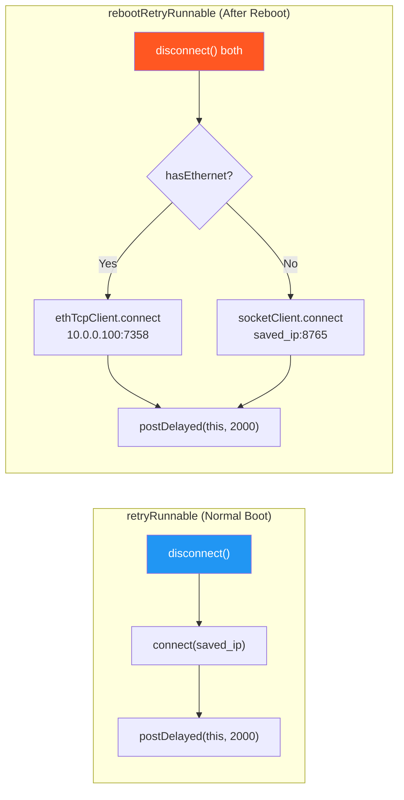
```mermaid
flowchart LR
    subgraph "retryRunnable (Normal Boot)"
        R1["disconnect()"] --> R2["connect(saved_ip)"]
        R2 --> R3["postDelayed(this, 2000)"]
    end

    subgraph "rebootRetryRunnable (After Reboot)"
        RR1["disconnect() both"] --> RR2{"hasEthernet?"}
        RR2 -- Yes --> RR3["ethTcpClient.connect<br/>10.0.0.100:7358"]
        RR2 -- No --> RR4["socketClient.connect<br/>saved_ip:8765"]
        RR3 --> RR5["postDelayed(this, 2000)"]
        RR4 --> RR5
    end

    style R1 fill:#2196F3,color:#fff
    style RR1 fill:#FF5722,color:#fff
```
